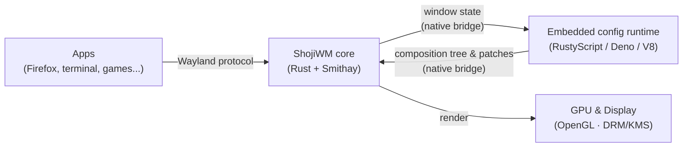
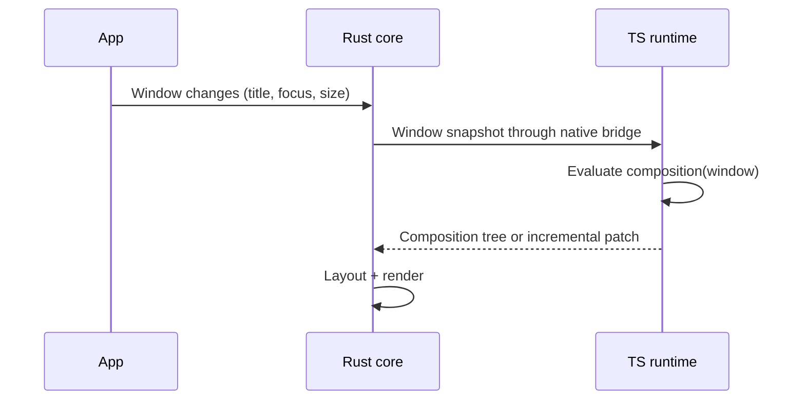

# ShojiWM Architecture

In one sentence: **ShojiWM is a Wayland compositor with a fast core written in
Rust, whose look and behavior you describe in TypeScript/TSX** (or in Rust, or
any language with a config runtime).

## The big picture



- **Apps** talk to ShojiWM through the standard **Wayland protocol**.
- The **Rust core** handles input, windows, and rendering — the parts that must
  be fast and reliable.
- The **TypeScript config runtime** decides how windows look and behave. It runs
  inside the `shoji_wm` process on the Deno/V8 engine embedded through
  RustyScript. You write this part — or write it in Rust instead, see
  [below](#the-config-runtime-is-pluggable).
- The core draws the final frame on the **GPU**.

## Two worlds: Rust core and TypeScript config

ShojiWM splits responsibilities into two layers inside one process:

| Layer | Runtime | Responsibility |
| --- | --- | --- |
| Core | Rust + Smithay | Wayland protocol, input, layout, GPU rendering |
| Config | TypeScript/TSX on embedded Deno/V8 | Window decorations, layout rules, effects, keybindings |

The config layer runs in an embedded V8 isolate rather than a separate Node.js
process. Rust and TypeScript exchange typed requests, composition trees, and
incremental patches through the in-process native bridge. Performance-sensitive
updates such as signal-driven shader uniforms avoid the old JSON process
boundary.

Node.js is therefore not required to run ShojiWM. It is only used by optional
repository tooling such as standalone TypeScript checks and the Docusaurus
documentation site.

## The config runtime is pluggable

The core does not depend on TypeScript. It talks to *a* config runtime through
a language-neutral interface (`shojiwm_lib::runtime_api`): it sends typed
requests (evaluate this window, run this key binding, tick the scheduler) and
receives answers and side effects (key bindings, outputs, processes). Anything
a runtime does not answer falls back to built-in behavior.

| Crate | What it is |
| --- | --- |
| `shojiwm_lib` | The compositor and the runtime interface. No V8. |
| `shoji_wm` | The TypeScript runtime (embedded V8) and the default `shoji_wm` binary. |
| `shojiwm_rs` | The Rust runtime: configs written in Rust, with the same reactive model as the TypeScript SDK. |

A runtime for another language is one more crate on top of `shojiwm_lib`. See
[Config languages](../configuration/languages.md).

## Server-Side Decoration (SSD) flow



## Directory layout

```
src/shojiwm_lib/                  Compositor core and the config runtime interface
src/shojiwm/                      TypeScript runtime and the default shoji_wm binary
src/shojiwm_rs/                   Rust config runtime
src/shojiwm_rs/examples/          The default config ported to Rust
src/xdg-desktop-portal-shojiwm/   Screen-cast portal
packages/shoji_wm/                TypeScript SDK
packages/config/                  Default TypeScript config
```
